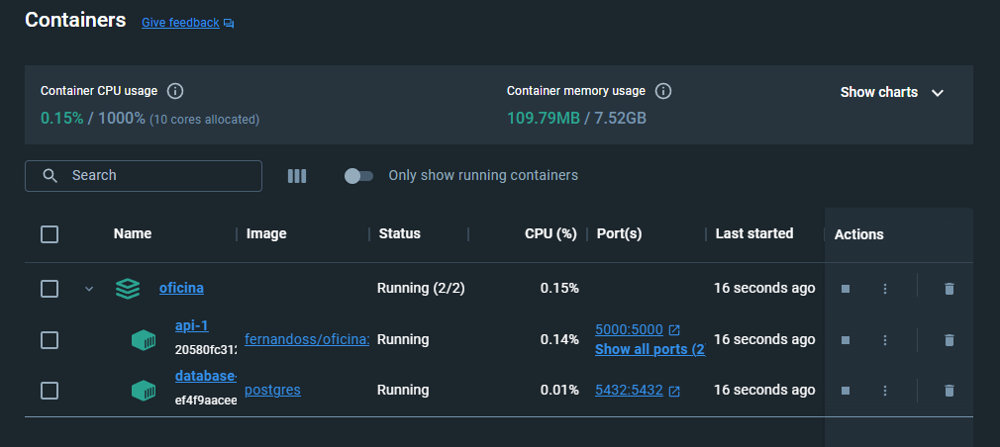

# Passo a passo backend oficina  ☝🤓
## Docker
- Instalar [Docker Desktop](https://docs.docker.com/desktop/install/windows-install/)
- Botar pra rodar
- Pode usar o seguinte comando para teste
    ```
    docker ps
    ```
    não pode dar erro e deve ter um resultado semelhante a esse:
    
- Baixar [esse arquivo do repositório](../docker-compose.yaml)
- Executar esse comando no mesmo diretório do arquivo:
    ```
    docker-compose up
    ```
- Deve baixar algumas imagens e avisar que está rodando
- Olhando o Docker Desktop ele deve estar assim:
    
    (Deve estar running e verdinho, se não tiver deu ruim)

## Backend rodando local

- Ao tentar acessar [essa url](http://localhost:5000/swagger/index.html) deve acessar um serviço swagger
